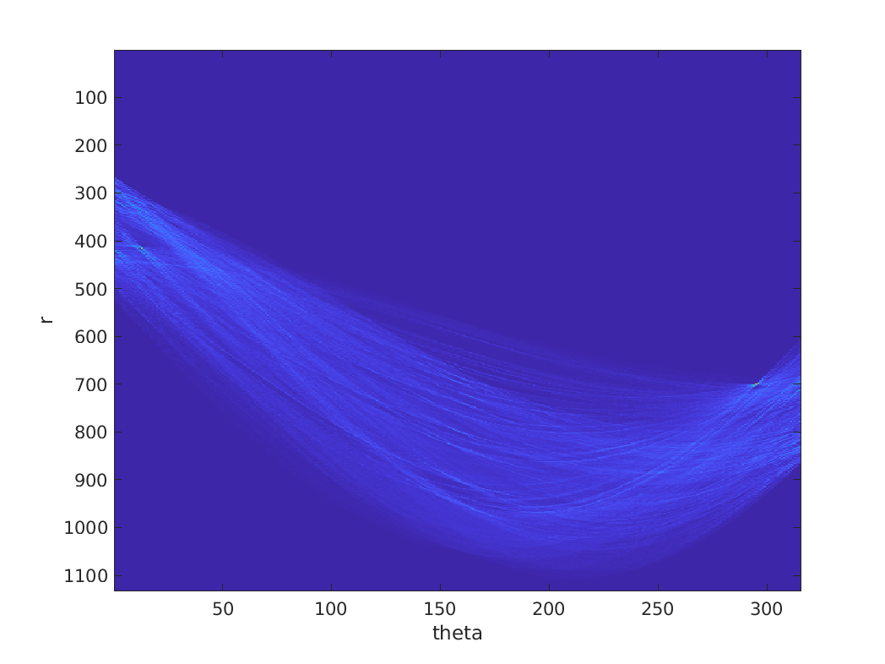

# computer_vision
CSE-185 Matlab projects


## Lab01
Introduction to Image Processing in Matlab

original | zeroed green channel | covert to greyscale from RGB with formula 
:---:|:---:|:---:
 | | 

rotate 90 deg | crop image | flip image
:---:|:---:|:---:
 | | 

### combine images manually with boarder

```matlab
canvas = zeros(300*2+10,400*2+10,3,'uint8'); % create the image

% read the input images
i01 = imread('01.jpg');
i02 = imread('02.jpg');
i03 = imread('03.jpg');
i04 = imread('04.jpg');

% place each image on the output canvas
canvas(1:300,1:400,:) = i01;
canvas(1:300,411:810,:) = i02;
canvas(311:610,1:400,:) = i03;
canvas(311:610,411:810,:) = i04;
```


## Lab02 
Translation, rotation, forward warping, backward warping, and median filter. 

original | forward warping | backward warping  
:---:|:---:|:---:
 | | 

original | noisy | median filter patch size 3   | median filter patch size 5  
:---:|:---:|:---:|:---:
 |  |  | 

## Lab03 
Spatial Filters

Implement sobel and gaussian filters

lena | sobel x | sobel y | gaussian 
:---:|:---:|:---:|:---:
 | | | 

## Lab04 

Split images into low and high frequency and create hybrid images

lena | lena low | lena high 
:---:|:---:|:---:
 |  | 

einstein | marilyn | hybrid mary low | hybrid einstein low 
:---:|:---:|:---:|:---:
 | | | 


## Lab05

Implement Gaussian Pyramid and Laplacian Pyramid and template matching with Sum of Square Distance (SSD) and Normalized Cross-Correlation (NormCorr)

### Lena Gaussian Pyramid
scale 1 | scale 2 | scale 3 | scale 4 | scale 5
:---:|:---:|:---:|:---:|:---:|
 |  |  |  |  

### Einstein Laplacian Pyramid
scale 1 | scale 2 | scale 3 | scale 4 | scale 5
:---:|:---:|:---:|:---:|:---:|
 |  |  |  |  


### Template Matching NormCorr 

#### Performs better with intensity changes than SSD

original | template | result
:---:|:---:|:---:
 |  | 

## Lab06 

Implement `sobel_feature.m` to compute gradient magnitude and orientation from Sobel Filtering

Original | Canny Edge | Sobel Edge
:-------------:|:-------------:|:-------------:
 |  | 

Original | Magnitude | Orientation
:-------------:|:-------------:|:-------------:
 |  | 


## Lab07 
Implement Harris_corner_detector

### Steps
1. Use derivative of Gaussian to compute image gradients
   - Compute the derivative of Gaussian and the apply filtering to the image
2. Compute the products of gradients at every pixel
3. Use gaussian filtering to compute the sum of products of gradients at every pixel
4. Compute the determinant and the trace of M 

5. Non-maxima suppression
6. Extract corner points and plot

### Results

baboon.png           |  cameraman.png | checkboard.png 
:-------------:|:-------------:|:-------------:
   |  | 


## Lab08 

Implementation of Hough Transform Cartesian and Hough Transform Polar

In this lab, we detect straight lines from an image using the image's edge map.

### Example of Hough Transform Cartesian applied on bridge.png

Bridge Cartesian Line             |  Bridge Cartesian Space 
:--------------------------------:|:--------------------------------:
   | 

### Example of Hough Transform Polar applied on bridge.png

Bridge Polar Line                 |  Bridge Polar Space 
:--------------------------------:|:--------------------------------:
| 

> More figures with their corresponding images can be found in the lab folder.